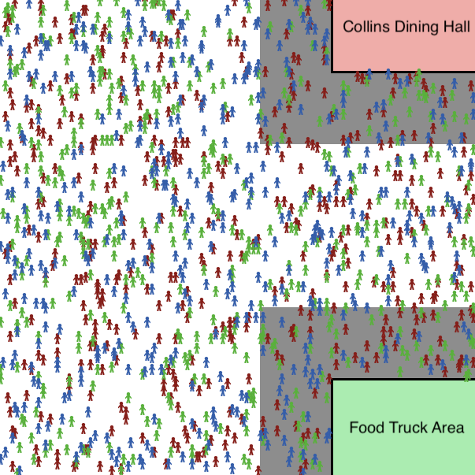

# cmc-dining-repo

This repository contains code for Netlogo models that simulate the dining policies for the Claremont McKenna College's dining hall during the Fall 2021 semester. The aim of the model was to model how overcrowding happened during the lunch period on weekdays.

# Model Visual

